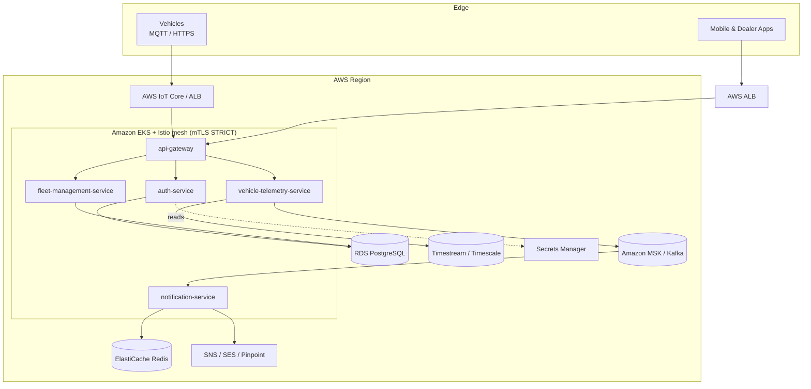

# Connected Cars — Architecture

## 1. Context

Connected vehicles continuously emit telemetry (location, speed, battery/fuel, diagnostics/DTCs, driver behavior). The platform must:

- Ingest **millions of events/day** with low latency and back-pressure tolerance.
- Provide **near-real-time alerts** (crash, low battery, geofence, maintenance).
- Expose **secure APIs** to mobile apps, dealers, and fleet operators.
- Be **multi-tenant, regional, and compliant** (PII, ISO 21434 / UNECE R155 cyber-security regs for automotive).

## 2. Logical components

## 3. Why these choices

| Concern | Choice | Rationale |
|---|---|---|
| Container orchestration | **Amazon EKS** | Managed K8s control plane, IRSA for fine-grained IAM, wide ecosystem. |
| Service-to-service | **Istio service mesh** | mTLS by default, L7 traffic mgmt (canary, retries, circuit breaking), authz policies decoupled from app code. |
| Event backbone | **Amazon MSK (Kafka)** | Durable, high-throughput, replayable telemetry stream; decouples ingest from processing. |
| Relational data | **RDS PostgreSQL (Multi-AZ)** | Strong consistency for identity, registration, billing. |
| Cache / sessions | **ElastiCache Redis** | Low-latency dedup, rate-limit counters, notification throttling. |
| Time-series | **Timestream / Timescale** | Purpose-built for telemetry queries and retention tiers. |
| Secrets | **Secrets Manager + External Secrets Operator** | No secrets in Git; rotation. |
| Edge ingest | **AWS IoT Core (MQTT)** | Millions of device connections, X.509 device auth. |
| CDN / API edge | **ALB + AWS WAF** | TLS termination, WAF rules, path routing to Istio ingress. |

## 4. Cross-cutting

- **Security**: Istio STRICT mTLS mesh-wide; JWT `RequestAuthentication` at the edge; `AuthorizationPolicy` per service; K8s RBAC least-privilege; IRSA for pod→AWS access; WAF at the edge.
- **Observability**: Prometheus + Grafana (metrics), Jaeger (tracing via Istio), Kiali (mesh topology), Loki (logs), OpenTelemetry SDK in apps.
- **Resilience**: Multi-AZ, HPA + Cluster Autoscaler / Karpenter, Istio retries + outlier detection, Kafka partitions for parallelism, PodDisruptionBudgets.
- **Scalability**: Stateless services behind mesh; Kafka consumer groups; read replicas; sharded time-series.
- **Delivery**: GitHub Actions CI (build/test/scan) → GHCR images → Argo CD / kubectl GitOps to EKS. Progressive delivery via Istio canary weights.

## 5. Well-Architected mapping

- **Operational Excellence** — GitOps, IaC (Terraform), runbooks, dashboards.
- **Security** — mTLS, least-privilege IAM/RBAC, WAF, encryption at rest (KMS) & in transit.
- **Reliability** — Multi-AZ, autoscaling, circuit breaking, Kafka durability, backups.
- **Performance Efficiency** — Right-sized nodes (Karpenter/Graviton), caching, async event pipeline.
- **Cost Optimization** — Spot for stateless workers, Graviton, S3 tiering for cold telemetry, autoscaling to zero for non-prod.
- **Sustainability** — Graviton (ARM), spot, scale-down policies.
